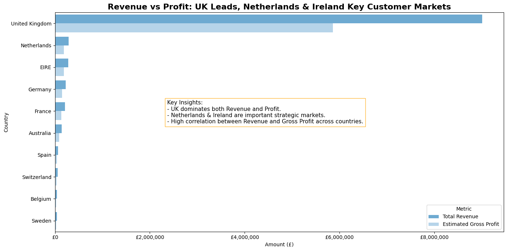
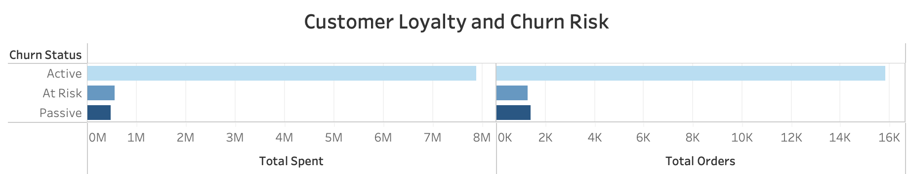
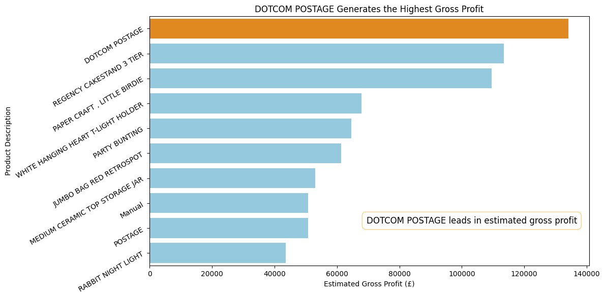
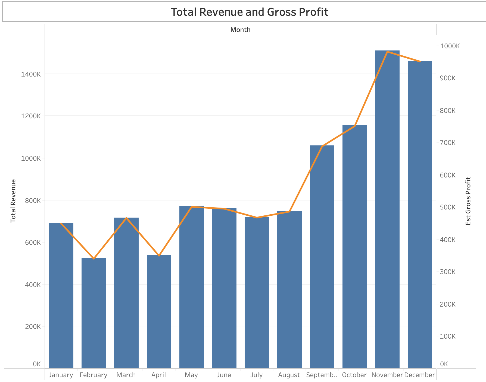

# UK E-Commerce Sales Analysis

## Table of Contents
1. [Project Overview]()
2. [Business Questions]()
3. [Analysis Approach]()
    - [Geographic Insights](#1-geographic-insights)
    - [Customer Loyalty & Churn Risk](#2-most-loyal-customer-and-risk-to-leave)
    - [Product Profitability](#3-strongest-products)
    - [Seasonality & Marketing Timing](#4-seasonality-insights)
4. [Key Findings & Insights](#key-findings--insights)
5. [Strategic Recommendations](#strategic-recommendations)
6. [Next Steps](#next-steps)
7. [Technical Details](#technical-details)
8. [Author & Contact](#author--contact)

---

## Project Overview

**Description:**

This project analyzes a transnational dataset containing all transactions from 01/12/2010 to 09/12/2011 for a UK-based, registered non-store online retailer. The company primarily sells unique all-occasion gifts, and many of its customers are wholesalers.

**Objective:**

The goal of this project is to extract actionable insights on profitability, customer behavior, product performance, and seasonal trends. These insights will inform strategic decisions around marketing, product focus, and customer retention.

**Dataset includes:**
- **Transaction-level data:** 25,900 unique invoices across 4,000+ products, 4,300+ customers, and 38 countries, including invoice number, product codes, quantity, unit price, customer ID, and country.

- **Customer details:** loyalty status, churn risk indicators

- **Product information:** descriptions, categories, and gross margin contribution

- **Temporal data:** invoice dates to analyze seasonality

---

## Financial KPIs

| KPI                  | Description                    | Formula                             |
| -------------------- | ------------------------------ | ----------------------------------- |
| Gross Margin %       | Profitability indicator        | (Revenue – COGS) / Revenue          |
| Avg. Order Value     | Purchase efficiency            | Revenue / Orders                    |
| Repeat Purchase Rate | Customer loyalty               | Repeat Customers / Total Customers  |
| Customer Retention   | Ongoing revenue stability      | Active Customers (t) / Active (t–1) |
| Country Margin       | Financial efficiency by region | (Revenue – Costs) / Revenue         |

---

## Business Questions

1. **Regional Profitability:**

    - Which countries contribute most to revenue and profit? Which underperform relative to others?

2. **Customer Loyalty & Churn Risk**
    - Who are the most valuable customers (LTV)?
    - Are key customers at risk of leaving?
        - Metrics analyzed: Avg. Gross Margin per Customer, Churn Impact on Future Revenue, Retention Cost vs. Recovery Value

3. **Product Profitability:**
    - Which products generate the highest gross margins? How should inventory and promotions be prioritized?

4. **Seasonality:**
    - When should marketing spend be increased to maximize ROI?
        - Metrics analyzed: Revenue & Profitability by Month

---

## Analysis Approach

### 1. Geographic Insights

**SQL Query:** [1_geographic](Scripts/1_geographic.sql)

**Visualization:**

*Highlights that the UK leads in revenue and profit, suggesting it should remain the primary focus for marketing and expansion, while Netherlands and Ireland show opportunities for growth.*

**Key Insights:**

- The UK dominates both revenue and gross profit, confirming it as the primary market.

- Netherlands and Ireland (EIRE) show strong profitability, indicating potential for expansion.

- Revenue and profit are highly correlated across countries, suggesting consistent cost structures.

---

### 2. Customer Loyalty & Churn Risk

**SQL Query:** [2_customer_behavior.sql](Scripts/2_customer_behavior.sql)

**Visualization:**

*Shows revenue contribution by customer segments, identifying “Active” vs. “At Risk” customers.*

**Key Insights:**

- Active customers account for the majority of revenue.

- Customers labeled “At Risk” contribute significantly less, validating the accuracy of churn indicators.

- Retaining high-value customers is cost-effective and crucial for sustainable growth.

---

### 3. Strongest Products

**SQL Query:** [3_product_performance.sql](Scripts/3_product_performance.sql)

**Visualization:**

*Ranks the most profitable products, emphasizing the impact of high-margin items like DOTCOM POSTAGE.* 

**Key Insights:**

- DOTCOM POSTAGE generates the highest profit, despite lower overall sales volume.

- High revenue does not always translate to high profit; focusing on margin per product is more effective.

- Prioritizing high-margin products in promotions can significantly boost profitability.

---

### 4. Seasonality Insights

**SQL Query:** [4_seasonality.sql](Scripts/4_seasonality.sql)

**Visualization:**

*Illustrates seasonality trends, with November and August as peak revenue months while profit margins remain stable.*

**Key Insights:**

- Revenue peaks in November, reflecting holiday-driven demand.

- Profit margins remain stable even during high-revenue months.

- Strategic marketing spend during peak months can maximize ROI.

---
## Key Findings and Insights

| Metric / Focus              | Key Insight                                                                                    |
| --------------------------- | ---------------------------------------------------------------------------------------------- |
| Revenue by Country          | UK drives the highest revenue and profit; Netherlands and Ireland are high-potential markets.  |
| Customer Segments           | Active customers generate most revenue; “At Risk” customers contribute significantly less.     |
| Product Profitability       | DOTCOM POSTAGE and other high-margin products contribute disproportionately to profit.         |
| Seasonal Trends             | Revenue peaks in November (holiday season) and August (summer sales); margins remain stable.   |
| Repeat Purchase & Retention | Customers with multiple repeat purchases show 2–3x higher lifetime value than one-time buyers. |

---

## Strategic Recommendations

1. Focus marketing efforts on high-margin products to maximize profitability.

2. Expand operations and targeted promotions in high-performing countries like the Netherlands and Ireland.

3. Implement retention strategies for “At Risk” high-value customers to reduce churn.

4.  Plan campaigns around seasonal peaks (August and November) to optimize ROI.

5.  Use moderate discounting strategies to balance sales growth and profit margins.

---

## Next Steps

- Build predictive models for customer churn and lifetime value (LTV).

- Test A/B marketing campaigns to validate ROI assumptions during peak months.

- Conduct cohort analysis to refine retention strategies.

- Explore dynamic pricing based on seasonal and product-level profitability trends.

- Increase retention of ‘At Risk’ customers by 15% through targeted campaigns.
---

## Technical Details

- **Database:** PostgreSQL  
- **Data Analysis:** SQL (with DBeaver), Python
- **Visualization:** Python (pandas, numpy, matplotlib, seaborn), Tableau  

--- 

### Author & Contact
**Dmitry Kuvyrdin**  
📧 [dmitry.kuvy@gmail.com](dmitry.kuvy@gmail.com)  
💼 [LinkedIn Profile](https://www.linkedin.com/in/dmitry-kuvyrdin/) 

